# Итоговая контольная работа по блоку Специализация
## 1-5. Linux
Файлы и история команд находятся в корне репозитория
## 7-13. MySQL
###7
```
create database humans_friends;
```
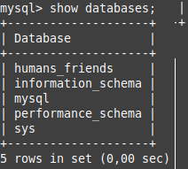
###8
```
create table animal (id Int NOT NULL primary key AUTO_INCREMENT, name Varchar(15));
create table home_animal (select * from animal);
create table pack_animal (select * from animal);
```
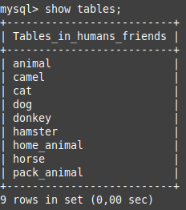
#9
```
create table cat (id Int NOT NULL primary key AUTO_INCREMENT, name Varchar(15), birth date, commands Varchar(50));
create table dog (id Int NOT NULL primary key AUTO_INCREMENT, name Varchar(15), birth date, commands Varchar(50));
create table hamster (id Int NOT NULL primary key AUTO_INCREMENT, name Varchar(15), birth date, commands Varchar(50));
create table horse (id Int NOT NULL primary key AUTO_INCREMENT, name Varchar(15), birth date, commands Varchar(50));
create table camel (id Int NOT NULL primary key AUTO_INCREMENT, name Varchar(15), birth date, commands Varchar(50));
create table donkey (id Int NOT NULL primary key AUTO_INCREMENT, name Varchar(15), birth date, commands Varchar(50));
INSERT into cat (name, birth, commands) VALUES ('Murzik', '2021/11/23', 'sit down, voice'), ('Murka', '2022/07/26', 'voice');
INSERT into dog (name, birth, commands) VALUES ('Pushok', '2019/08/17', 'sit down, lay, voice'), ('Sharik', '2021/03/07', 'voice, lay');
INSERT into hamster (name, birth, commands) VALUES ('Homka', '2024/01/07', 'jump'), ('Pushistik', '2023/12/27', 'stand');
INSERT into horse (name, birth, commands) VALUES ('Veterok', '2011/07/10', 'walk, run'), ('Groza', '2015/09/12', 'walk');
INSERT into camel (name, birth, commands) VALUES ('Sultan', '2010/06/24', 'walk'), ('Agata', '2012/10/06', 'walk, run');
INSERT into donkey (name, birth, commands) VALUES ('Ia', '2012/12/10', 'walk'), ('Oslo', '2012/09/13', 'walk');
```
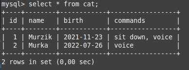
*Cats*
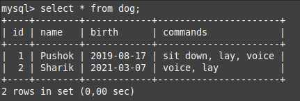
*Dogs*
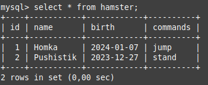
*Hamsters*
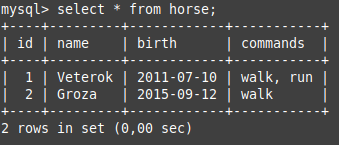
*Horses*
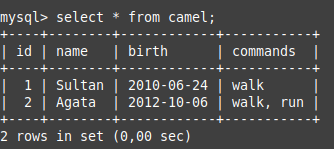
*Camels*
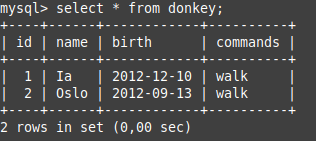
*Donkeys*
#10
```
drop table camel;
create table horses_and_donkeys (select * from horse union select * from donkeys);
```
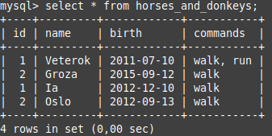
#11
```
create table young_animals (
select * from cat
where TIMESTAMPDIFF(MONTH, birth, NOW()) BETWEEN 12 AND 36
union
select * from dog
where TIMESTAMPDIFF(MONTH, birth, NOW()) BETWEEN 12 AND 36
union
select * from hamster
where TIMESTAMPDIFF(MONTH, birth, NOW()) BETWEEN 12 AND 36
union
select * from horse
where TIMESTAMPDIFF(MONTH, birth, NOW()) BETWEEN 12 AND 36
union
select * from donkey
where TIMESTAMPDIFF(MONTH, birth, NOW()) BETWEEN 12 AND 36
);
```
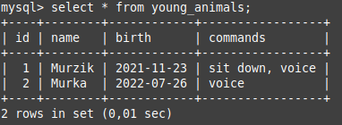
#13
```
create table all_animals (
select *, 'Cat' as animal_type from cat
union
select *, 'Dog' as animal_type from dog
union
select *, 'Hamster' as animal_type from hamster
union
select *, 'Horse' as animal_type from horse
union
select *, 'Donkey' as animal_type from donkey
);
```
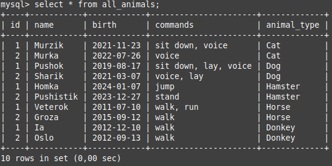
## 14-15. Программа
Програма находится в папке *program*.  
Программа написана на Python и имеет следующий функционал:
* Добавление нового животного
* Удаление животного
* Показ команд животного
* Показ информации о животном
* Обучение животного новой команде
* Показ всех животных
Навигация по меню и обработка ошибок присутствуют.
